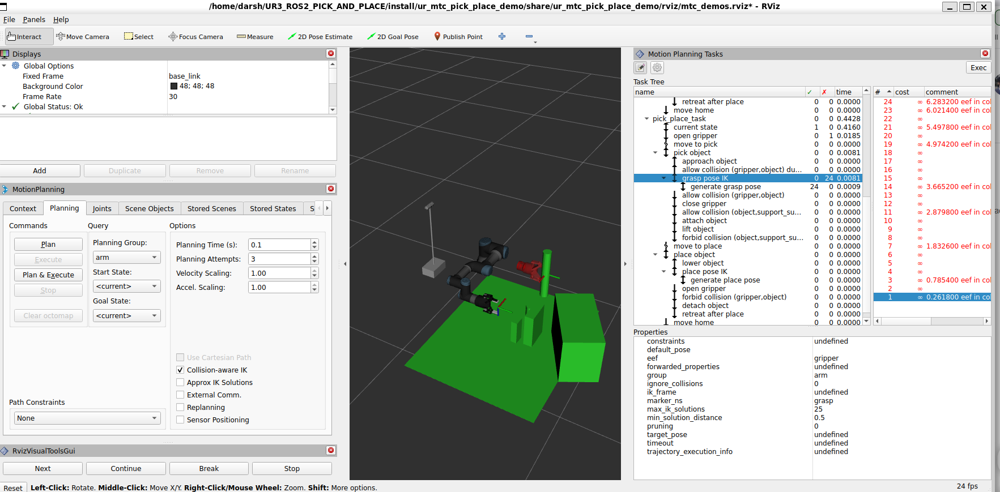

# UR Robotic Arm with Robotiq 2-Finger Gripper for ROS 2

This project integrates the Robotiq 2-Finger Gripper with a Universal Robots UR3 arm using ROS 2 Jazzy and Gazebo Harmonic. It includes URDF models, ROS 2 control configuration, simulation launch files, and control scripts.

> ✅ **Note:** This setup uses **fixed mimic joint configuration** for the Robotiq gripper to support simulation in **newer Gazebo (Harmonic)**. Only the primary `finger_joint` receives commands—mimic joints automatically follow.

---

## 📦 Installation

Make sure you have [ROS 2 Jazzy](https://docs.ros.org/en/jazzy/index.html) and Gazebo Harmonic installed.

### 1. Clone the Repository
```bash
git clone https://github.com/darshmenon/UR3_ROS2_PICK_AND_PLACE.git
cd UR3_ROS2_PICK_AND_PLACE
```

### 2. Install Dependencies
```bash
sudo apt install ros-jazzy-rviz2 \
                 ros-jazzy-joint-state-publisher \
                 ros-jazzy-robot-state-publisher \
                 ros-jazzy-ros2-control \
                 ros-jazzy-ros2-controllers \
                 ros-jazzy-controller-manager \
                 ros-jazzy-joint-trajectory-controller \
                 ros-jazzy-position-controllers \
                 ros-jazzy-gz-ros2-control \
                 ros-jazzy-ros2controlcli \
                 ros-jazzy-gz-sim
```

### 3. Build the Workspace
```bash
cd ~/your_ros2_ws  # Replace with your workspace path
colcon build --symlink-install
source install/setup.bash
```

---
## 🧩 MoveIt Task Constructor Setup

To enable advanced pick-and-place planning with MoveIt 2, this project supports [MoveIt Task Constructor (MTC)](https://github.com/ros-planning/moveit_task_constructor).  
Instead of duplicating the full setup process, we've included a detailed guide in a separate submodule:

📄 **Follow the MTC installation and patching guide here:**  
[`ur_mtc_pick_place_demo/README.md`](ur_mtc_pick_place_demo/README.md)

This includes:
- Cloning the correct MTC branch and commit
- Installing dependencies
- Fixes for planning scene execution issues
- Rebuild instructions

Once complete, you'll be ready to run scripted and interactive pick-and-place pipelines using MTC!


## 🚀 Launch Instructions

### Launch Full Simulation in Gazebo
```bash
ros2 launch ur_gazebo ur.gazebo.launch.py
```

### Launch RViz Visualization (UR3 + Gripper)
```bash
ros2 launch ur_description view_ur.launch.py ur_type:=ur3
```

### Launch Gripper Visualization Alone
```bash
ros2 launch robotiq_2finger_grippers robotiq_2f_85_gripper_visualization/launch/test_2f_85_model.launch.py
```

---

## 🤖 Move the Arm from CLI

Send a simple trajectory:
```bash
ros2 action send_goal /arm_controller/follow_joint_trajectory control_msgs/action/FollowJointTrajectory \
'{
  "trajectory": {
    "joint_names": [
      "shoulder_pan_joint",
      "shoulder_lift_joint",
      "elbow_joint",
      "wrist_1_joint",
      "wrist_2_joint",
      "wrist_3_joint"
    ],
    "points": [
      {
        "positions": [0.0, -1.57, 1.57, 0.0, 1.57, 0.0],
        "time_from_start": { "sec": 2, "nanosec": 0 }
      }
    ]
  }
}'
```

---

## 🔁 Run Arm-Gripper Automation Script

Run a full pick-return-release loop:
```bash
python3 ~/UR3_ROS2_PICK_AND_PLACE/ur_system_tests/scripts/arm_gripper_loop_controller.py
```

---

## 📸 Screenshots

### UR3 with Robotiq Gripper in RViz  


### Robotiq Gripper Close-up  


### Simulation in Gazebo  


### RViz Overview  


### mtc Overview  


### mtc Overview  



## 📂 Project Structure

- `urdf/`: Robot and gripper XACROs  
- `launch/`: Launch files for simulation and visualization  
- `config/`: Controller YAML and joint limits  
- `scripts/`: Python control scripts  
- `images/`: Preview screenshots  

---

## 🤝 Contributing

Feel free to open pull requests or issues if you have improvements or bug reports.

---

## 📄 License

This project is licensed under the MIT License. See the [LICENSE](LICENSE) file for more information.

---

Let me know if you want a separate section on controller config, MoveIt 2 integration, or Gazebo troubleshooting tips.